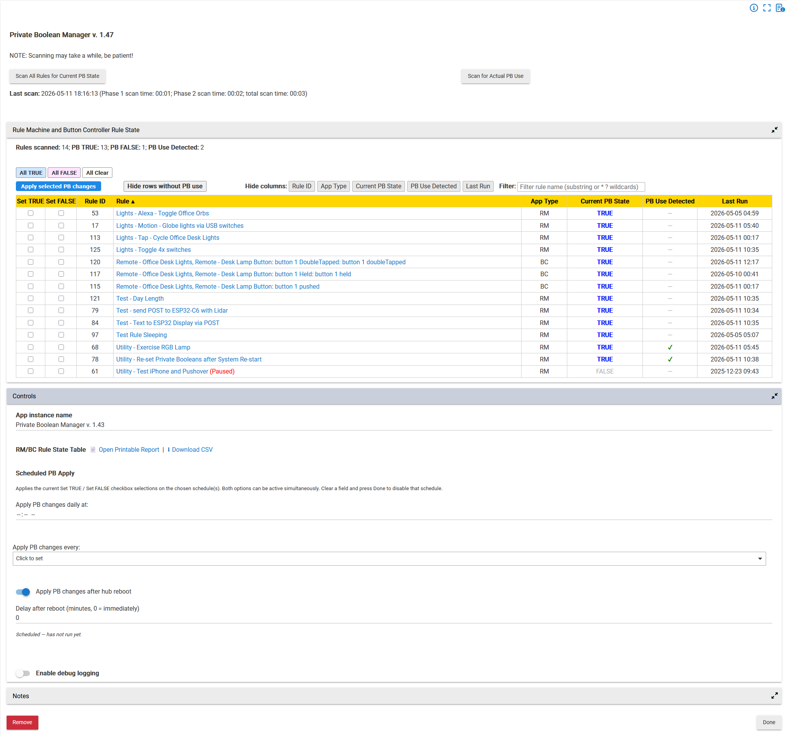

# Private Boolean Manager

A [Hubitat Elevation](https://hubitat.com/) app for Rule Machine (RM) and Button Controller (BC) rules. It has two main functions:

1. It scans RM/BC rules and displays each rule's **Private Boolean state**, **PB use detection**, and **Last Run time** in a sortable table.
2. It lets you set Private Boolean values for multiple rules, either manually from the table or automatically on a schedule.

---

## Screenshot



---

## Installation

1. In the Hubitat web UI, go to **Apps Code → + New App** and paste in the app's Groovy source.
2. Save the app code.
3. Go to **Apps → + Add User App** and select **Private Boolean Manager**.
4. The app will attempt to create an OAuth token automatically on first open. If it does not, enable OAuth manually in Apps Code for this app and re-open it.
5. No scan runs automatically on install. Click **Scan All Rules for Current PB State** or **Scan for Actual PB Use** to begin.

---

## Usage

### Scanning

Two scan modes are available:

**Scan All Rules for Current PB State** fetches only the runtime status of each rule: Private Boolean value and Last Run time. This is the faster Phase 1 scan, but it may still take a minute or more for hundreds of rules.

**Scan for Actual PB Use** runs the Phase 1 scan first, then runs Phase 2. Phase 2 fetches each rule's internal configuration JSON and checks whether the rule references its own Private Boolean in a condition, action, or trigger. Phase 2 uses a queued `configure/json` pass and may take 5–10 minutes or more for hundreds of rules, especially if some rules are very large.

Before a PB usage scan runs, every **PB Use Detected** cell shows a dash (`—`). After a PB usage scan, cells show a green check mark (`✓`) for detected PB usage or a dash (`—`) when usage was not detected.

After a scan, the top summary shows counts for rules scanned, PB TRUE, PB FALSE, and PB Use Detected. The scan-time line shows Phase 1 time only for a current-state scan, or Phase 1, Phase 2, and total time for a full PB-use scan.

Clicking **Done** and reopening the app re-renders the table from cached data, so no rescan is needed for display-only changes. The cached table is still stale until a new scan is run.

---

### Rule State Table

The table lists every discovered RM and BC rule with the following columns:

| Column | Description |
|--------|-------------|
| **Set TRUE** | Checkbox — mark this rule to have its PB set TRUE on the next Apply |
| **Set FALSE** | Checkbox — mark this rule to have its PB set FALSE on the next Apply |
| **Rule ID** | Hubitat internal app ID for the rule |
| **Rule** | Rule name, linked directly to its configuration page |
| **App Type** | `RM` for Rule Machine or `BC` for Button Controller |
| **Current PB State** | The rule's Private Boolean value: **TRUE** in bold blue, FALSE in grey, or `—` if unreadable |
| **PB Use Detected** | Whether the rule references its own PB |
| **Last Run** | Date and time of the most recent trigger event, formatted as `yyyy-MM-dd HH:mm` |

**Sorting** — click any column header to sort by that column; click again to reverse the sort direction.

**Filter** — use the wildcard/name filter above the table to show only matching rules. The filter state persists without clicking **Done**.

**Hide columns** — column-hide buttons let you show or hide supported columns. Column visibility persists without clicking **Done**.

**Hide rows without PB use** — hides all rows where **PB Use Detected** is `—`, including stale scans where no stale red check mark is present. Click **Show all rows** to restore hidden rows.

**Bulk row buttons** — **All TRUE**, **All FALSE**, and **All Clear** skip hidden rows.

---

### PB Use Detected Column

The **PB Use Detected** column shows whether the rule references its own Private Boolean in a condition, action, or trigger.

| Cell | Meaning |
|------|---------|
| Green **✓** | Current Phase 2 scan detected PB usage in this rule |
| Red **✓** | A prior Phase 2 scan detected PB usage, and a Phase 1-only scan has run since then; the result is stale |
| **—** | PB usage was not detected, or no PB usage scan has been run yet |

A full **Scan for Actual PB Use** is a combined Phase 1 and Phase 2 scan. After it completes, detected PB usage appears as a green check mark. After that, if you run **Scan All Rules for Current PB State** only, prior PB-use detections are carried forward as red stale check marks. Running **Scan for Actual PB Use** again refreshes the PB-use cells and returns fresh detections to green.

PB-use detection reads each rule's internal configuration JSON from:

```text
/installedapp/configure/json/{id}
```

It searches for two confirmed RM 5.0 patterns:

- `"getSetPrivateBoolean"` — the `actSubType` value when a rule action sets the PB TRUE or FALSE.
- `:"Private Boolean"` — the `rCapab_N` or `tCapab_N` value when the PB is referenced in a condition or trigger.

> **Large rules:** Rules with very large configuration JSON may have their `configure/json` response dropped or time out. Those rules show `—` for PB Use Detected rather than stopping the rest of the scan. The queued scan and watchdog continue with the remaining rules.

---

### Setting Private Booleans

#### Checkbox columns — bulk apply

Each row has **Set TRUE** and **Set FALSE** checkboxes.

- Checking one automatically clears the other for that row.
- Leaving both unchecked means no change for that rule.
- Checkbox selections persist across page refreshes and Done/reopen cycles.

The bulk buttons operate on visible rows only. Filtered-out or hidden rows are skipped.

| Button | Action |
|--------|--------|
| **All TRUE** | Checks Set TRUE and clears Set FALSE for every visible row |
| **All FALSE** | Checks Set FALSE and clears Set TRUE for every visible row |
| **All Clear** | Clears Set TRUE and Set FALSE for every visible row |

Click **Apply selected PB changes** to send all pending changes to the hub. The table updates immediately, but the app does not re-read the affected rules to verify that the hub accepted the change. If a rule's PB value appears unchanged after a rescan, the hub may have silently rejected the action, for example because of a wrong RM version or because the rule was deleted since the last scan.

#### Current PB State column — in-table toggle

Click any **Current PB State** cell to toggle that rule's PB in-place.

- TRUE is shown in bold blue.
- FALSE is shown in grey.
- A cell showing `—` means the PB state could not be read and is not clickable.

As with bulk apply, the toggle updates the table immediately and does not re-read the rule to confirm that the change took effect.

---

### Scheduled PB Apply

Three independent schedule options are available in the **Controls** section. Any combination can be active at the same time. Each applies whichever Set TRUE / Set FALSE checkboxes are currently saved — the same state used by **Apply selected PB changes**.

| Option | How to configure |
|--------|-----------------|
| **Daily at a specific time** | Set a time in **Apply PB changes daily at:** and click Done |
| **Every N minutes** | Choose an interval (1, 2, 5, 10, 15, 20, 30, or 60 minutes) from **Apply PB changes every:** and click Done |
| **After hub reboot** | Enable **Apply PB changes after hub reboot** and optionally set a delay (0–60 minutes); click Done |

The last run timestamp and TRUE/FALSE counts appear below the schedule inputs after the first run. Clear or disable a schedule and click Done to remove it. Scheduled changes are fire-and-forget and are not verified by re-reading rule state.

---

### Reports

In the **Controls** section, after a scan:

- **Open Printable Report** opens a formatted HTML report of the scanned rules.
- **Download CSV** downloads the same table data as a CSV file.

Reports use the cached data from the most recent scan. If PB-use detections are stale, the printable report and CSV indicate stale results where applicable.

---

## Controls Section

| Control | Description |
|---------|-------------|
| **App instance name** | Rename this app instance |
| **Open Printable Report** | Open a printable HTML report after a scan |
| **Download CSV** | Download a CSV export after a scan |
| **Apply PB changes daily at:** | Optional daily schedule |
| **Apply PB changes every:** | Optional interval schedule (1–60 minutes) |
| **Apply PB changes after hub reboot** | Optional post-reboot apply, with configurable delay |
| **Enable debug logging** | Turns on verbose debug output to the Hubitat log; auto-disables after 30 minutes |

---

## Debug Logging

When **Enable debug logging** is turned on in the Controls section, the following additional output appears in the Hubitat log:

- **Per-rule Phase 1 results** — rule name, ID, app type, and Private Boolean value for each rule as it is scanned
- **Per-rule Phase 2 results** — PB-use detection result (`pbUsed=true/false`) for each rule's `configure/json` response
- **Phase 2 heartbeat resets** — each time the Phase 2 watchdog timer is reset by a completed callback
- **Single-rule PB toggle confirmations** — the rule ID and action when a Current PB State cell is clicked
- **Lifecycle events** — logged at install time and on each Done press (includes current label and whether a scan was active)
- **Rule discovery count** — number of RM/BC rules found by `/hub2/appsList` before scanning begins
- **Schedule setup confirmations** — daily time, interval, and systemStart subscription status on each Done press
- **Re-render-from-cache confirmations** — when the table is rebuilt from cached data on Done press

Debug logging auto-disables after 30 minutes to avoid filling the hub log.

---

## Technical Notes

The app uses the following Hubitat local/internal endpoints:

| Endpoint | Purpose |
|----------|---------|
| `/hub2/appsList` | Discover RM and BC rules |
| `/installedapp/statusJson/{appId}` | Read per-rule PB state and Last Run time during Phase 1 |
| `/installedapp/configure/json/{appId}` | Read per-rule configuration JSON for PB-use detection during Phase 2 |
| `/apps/api/{appId}/setPB` | In-table single-rule PB toggle |
| `/apps/api/{appId}/bulkPB` | Bulk PB apply from checkboxes |
| `/apps/api/{appId}/setpref` | Persist column-hide, filter, and checkbox preferences |
| `/apps/api/{appId}/report` | Printable HTML report |
| `/apps/api/{appId}/RM-BC_Rules.csv` | CSV export |

> **Warning:** The `/hub2/appsList`, `/installedapp/statusJson/`, and `/installedapp/configure/json/` endpoints are internal Hubitat APIs and are not formal public APIs. They could change in a future Hubitat platform update.

Private Boolean changes use `RMUtils.sendAction()` targeting **Rule Machine version 5.0**. Rules created under earlier Rule Machine versions may display their PB state correctly, but PB changes may be silently ignored.

---

## Limitations

- **No write verification.** PB changes are fire-and-forget. The table updates optimistically based on the requested value. Run **Scan All Rules for Current PB State** to confirm actual rule state from the hub.
- **Internal Hubitat APIs.** The app relies on internal JSON endpoints whose structure could change in future Hubitat platform versions.
- **RM 5.0 PB actions.** PB setting uses `RMUtils.sendAction()` with RM version `5.0`; older Rule Machine rules may not accept PB changes.
- **Large Phase 2 responses.** Very large rule configuration JSON may time out or be dropped. The rule will show `—` in PB Use Detected and the scan will continue.
- **Basic Button Controller excluded.** Basic Button Controller rules are not included because they use a different internal structure.
- **Cached display can be stale.** Clicking **Done** and reopening can re-render cached data without a rescan; run a scan to refresh actual hub state.

---

## Credits

Designed initially by John Land. Built by Claude AI, with an assist from ChatGPT. The in-table clickable-cell PB toggle technique was adapted from the work of **hubitrep**.
